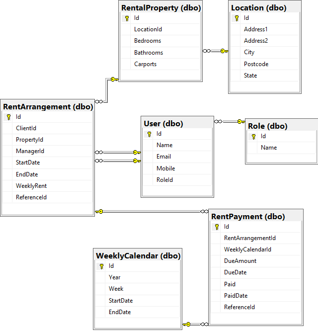
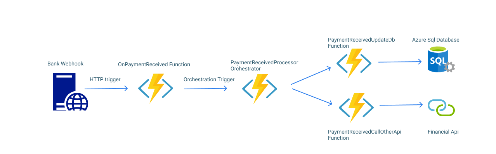
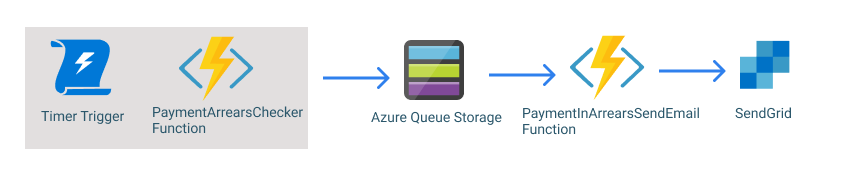
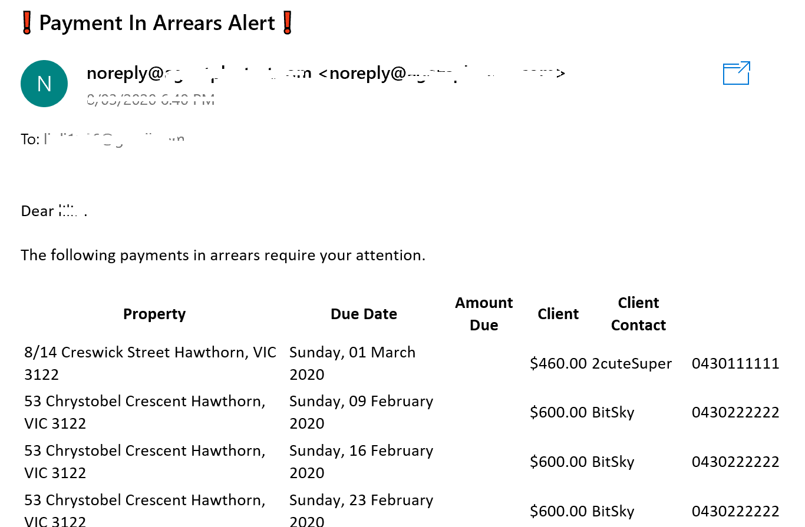

## Rent Arrears Alert solution design

A set of services are required to notify Property Manager if any rent has not been paid on time.

This document outlines the design process of deployed Azure Functions app.

#### Assumptions

- existing database with rent arrangement
- use any out of box Azure product
- interface with bank API when payment received

#### Requirement Analysis

There are two scenarios need to be addressed from user story.

1. React to external bank API event when client made payment and update internal database record
2. Automate rent arrears summary to Property Manager daily 

Many banks such as [CommBank](https://commbank.simplify.com/commerce/docs/misc/webhooks) provide webhook integration endpoint.
Webhook has the benefit of real time update when event occurs, on the other hand API uses poll mechanism to achieve the same outcome.
Webhook is also more efficient as it reduces outgoing HTTP requests. Therefore a webhook implemented as HTTP triggered Azure function is chosen as solution for issue 1. 
For issue 2, a scheduled job is required to run and check database if any rent due without payment, and then a summary all rent arrears will be sent to Property Manager.
Timer triggered Azure function can be run as scheduled task and email notification will be sent to Property Manager through SendGrid integration.

#### Solution Design

The tech stack: **Azure Functions** + **Azure Queue Storage** + **Entity Framework Core** + **Azure Sql Database** + **SendGrid**

The mock up database with dummy data has been created with following schema. 
Each rental agreement includes client, manager, start end dates and weekly rent.
Scheduled weekly payments are also created for each rental agreement between start and end date.

*Fig. 1: Database schema*

Whenever client makes payment to nominated account, the webhook receives an event from bank API and kicks off payment processing workflow.
PaymentReceivedProcessor as shown below is an Azure durable function which acts as an orchestrator to execute multiple functions concurrently.
For example we want to update relevant rent payment record so that it wont show on alert summary again, and also invoke other financial system to make data consistent.
We could add more functions as business required.

*Fig. 2: Payment received processing workflow*

The scheduled job checking rent arrears and sending alerts is implemented as timer triggered Azure function. 
The interval has default value 10 minutes for testing purpose, but can be adjusted through app setting.
When the job run, the PaymentsArrearsChecker function search for all rent payment records with DueDate before today and PaidData is null, 
then convert those records to message model and save to azure storage queue.
PaymentArrearsSendEmail function picks up message from the queue and send out alert to Property Manager.
The alert is sent by email with SendGrid integration, however other communication channels also possible, for example SMS via Twilio and push notification via Azure Notification Hubs.

*Fig. 3: Rent arrears check workflow*

*Fig. 4: Example email alert*

The solution also provides a rest api to return all arrears currently in the system.
You can [click link](https://lilinagentplustechtest.azurewebsites.net/api/paymentarrears) to see the response.
A shared Postman collection which includes post request simulating bank webhook can be accessed by click button 

